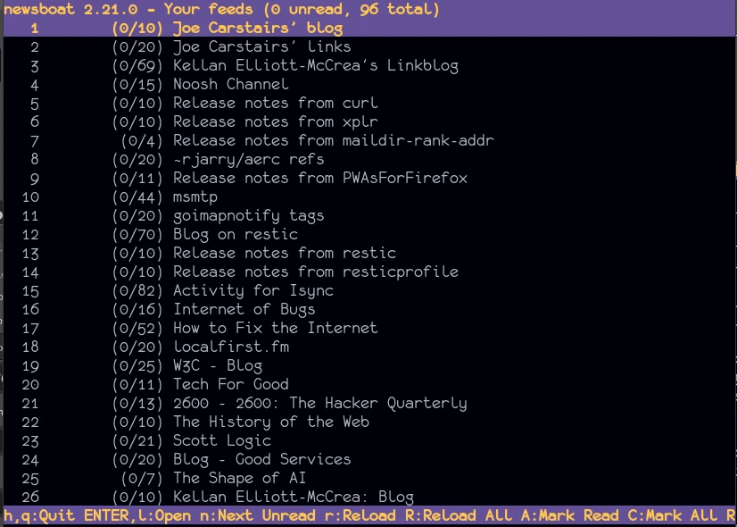
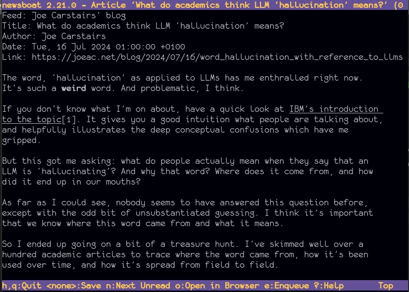
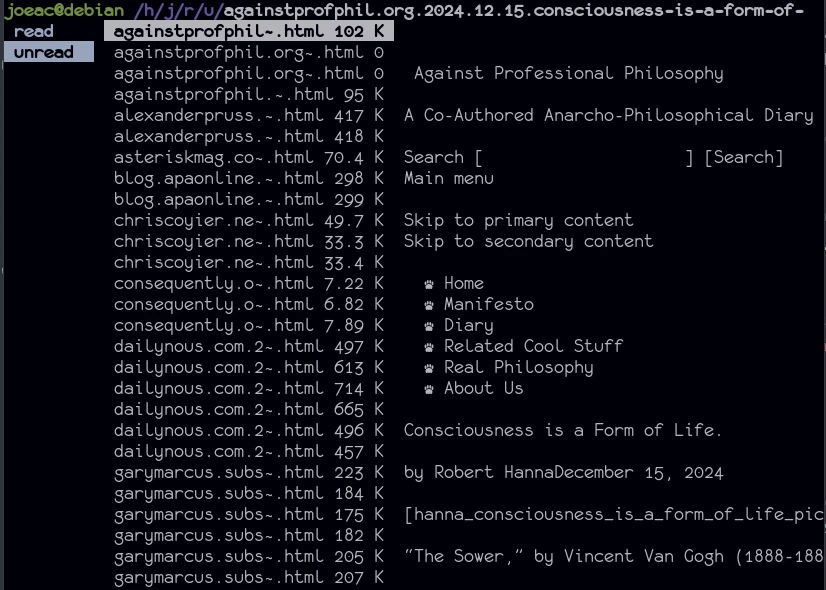
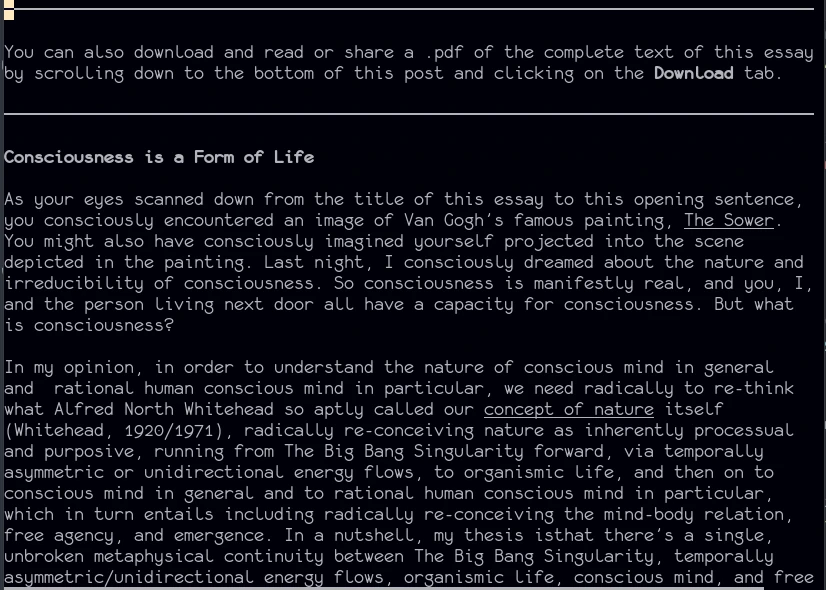

## The problem

I like to read things on the Internet sometimes. Or listen to things. Or watch
things.

Some interesting people write blog posts. Some beautiful people make music. Some
silly people make comedy sketches. Sometimes my friends are sharing stuff with
their friends, which means me (WIP on that front: I'll get back to that).

I want to know about it. I want to read interesting things that will educate
me. I want to hear beautiful music. I want to hear about what my friends are up
to.

I can't read everything as it comes in, it's too much: I'll need to sift a lot
of it out quickly. I'll need to sift through it regularly to stay on top of it:
like, several times a week, if not daily. And sometimes, while I'm doing my
daily sifting, I'll find something I really want to read, but I haven't got
time right now: I'll save this for the weekend.

For a while, I've been hosting [CommaFeed][commafeed] on [PikaPods][pikapods].
This has been OK ([OMG, RSS is cool][rss]), but the interface is just clunky
enough to make it a chore to use. That means I don't sift through stuff
regularly, and that means my feed piles hundreds of unread posts high.

It also hasn't been any good for distinguishing between stuff I don't want to
read *ever*, and stuff I don't want to read *right now* but will get round to
later. I could in theory use the bookmarking feature built-in to my browser,
but removing things after I've read them is too clunky, so I don't do it.

## The solution

Every morning, I open my terminal and run [newsboat][newsboat].



I know the unread count is pretty fresh, because I've set up a systemd service
to run newsboat at startup to fetch the feeds.

I press `l` twice to open a post. Then I press `n` to navigate to the next
unread post until I run out of unread posts.



If I encounter something I want to read later, but don't have time right now, I
press `b`, which runs a home-made bookmarking script. Here it is:

```bash
### readlater.sh ###

# newsboat passes a few arguments:
# the first one is the post URL
url="$1"

# I turn the URL into a suitable filename
filename=$( \
  echo $url | \
  sed "s/.*:\/\///" | \
  sed "s/\//./g" | \
  sed "s/\.html\$//g" \
)
filename="$filename".html

# If I've already got this in my reading list,
# I don't add it again
if [[ -a "$HOME/readlist/unread/$filename" ]]
then
  exit 0
fi

# Otherwise, I download the post with curl
# and pipe it to a file in my reading list
# folder, ~/readlist/unread
curl "$url" > "$HOME/readlist/unread/$filename"
```

I can also run this script manually and pass it a URL of my choice at any time,
say, if I find an interesting article while browsing the Web.

When I want to read from my reading list, I run `readnow.sh`, which simply
opens my reading list folder, `~/readlist/unread`, in my terminal file browser
of choice: namely, [ranger][ranger].



Although ranger has a preview, I'll typically open the file up in my terminal
web browser of choice, which is [w3m][w3m] (plus a couple of custom
key-bindings). I've configured this to be my preferred web browser in ranger by
shifting it to the top of the list of HTML browsers in
`~/.config/ranger/rifle.conf`.

```conf
### ~/.config/ranger/rifle.conf ###

...

ext x?html?, has w3m,               terminal = w3m "$@"
ext x?html?, ...

...
```

Having configured my default web browser in my ranger config, all
I need to do is press `l`.



No ads, no cookie popups, no giant banner images taking 2 seconds to load and
shifting the content all over the place: just the text I want to read. Isn't it
beautiful?

Once I'm finished reading the post, I'll press `q` to quit w3m and return to
ranger. Assuming I don't need to read it again, I'll press `dm` to move the
post to `~/readlist/read` - my way of marking a post as 'read'.

I've done this by writing a super simple script, `markread.sh`:

```bash
### markread.sh ###

filename="$(basename $1)"

if [[ -a "$HOME/readlist/unread/$filename" ]]
then
  mv "$HOME/readlist/unread/$filename" "$HOME/readlist/read/$filename"
  echo "Marked $filename as read."
else
  echo "I couldn't find a file in ~/readlist/unread with the name: $filename"
fi
```

...and hooking it onto the custom keybinding, `dm`, in ranger:

```conf
### ~/.config/ranger/rc.conf ###

...

# map `dm` to run markread.sh in the shell, providing the active filename
# as the first and only argument
map dm shell markread.sh %f

...
```

## The result

I can now keep up to date, and I enjoy doing it.

I get not everyone likes to live in the terminal. I think the key takeaways
are:

- Make it really easy to sift through new posts
- When you sift, sift through every post, and for each one, either read it
  straight away, or add it to your reading list
- Sift daily
- Make it really easy to add things to your reading list
- Make it really easy to browse, read things, and mark things read in your
  reading list
- Set aside time to catch up on your reading list
- Make the whole thing joyful (both because joy is good, and because you won't
  do it otherwise)

## Next steps

I still haven't really figured out social media. I'd like to stay up to date
with what my friends are doing, especially the ones I don't see very often. If
my friends are posting stuff on the Internet, I'd love to see it.

I still need to know:

- Are my friends posting stuff on the Internet?
- If so, where?
- What's the best way of subscribing to their posts - even if they live on
  different websites and in different formats?
- What's the best way of sending and receiving comments/replies/reactions?

TBC. Answers on a postcard please.

[commafeed]: https://www.commafeed.com
[pikapods]: https://www.pikapods.com
[newsboat]: https://newsboat.org
[ranger]: https://ranger.github.io
[rss]: /blog/2024/05/02/no_more_youtube
[w3m]: https://w3m.sourceforge.net
